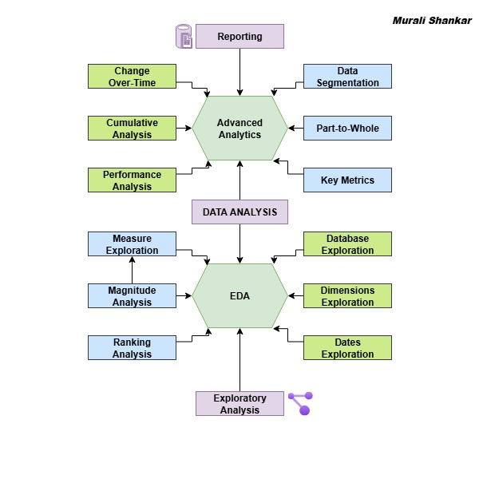

# 📊 SQL EDA Project

A structured SQL-based exploratory data analysis (EDA) project designed around a retail-style dataset. 
The repository covers end-to-end data exploration, KPI generation, magnitude analysis, and ranking analysis.

---

## 📂 Repository Structure

**Root Directory**
- `Datasets/` → Contains raw data and backup files  
  - `gold.dim_customers.csv`
  - `gold.dim_products.csv`
  - `gold.fact_sales.csv`
  - `DataWarehouseAnalytics.bak`

- `Reference_Materials/` → Supporting visuals, keywords, and notes  
  - `analysis_keywords.png`

- `Exploration_Analysis_Scripts/` → All SQL scripts for analysis  
  - `1_Exploration.sql`  
  - `2_KeyMetrics_Report.sql`  
  - `3_Magnitude_Analysis.sql`  
  - `4_Ranking_Analysis.sql`

- `README.md` → Project documentation

---

## 🗂️ Workflow of SQL Scripts

The analysis is designed as a **progressive flow**. Each script builds on the previous one. Click on the links below to navigate:

1. [🔍 Database & Dimension Exploration](Exploration_Analysis_Scripts/1_Exploration.sql)
   ⬇️
2. [📑 Key Metrics Report](Exploration_Analysis_Scripts/2_KeyMetrics_Report.sql)
   ⬇️
3. [📊 Magnitude Analysis](Exploration_Analysis_Scripts/3_Magnitude_Analysis.sql)
   ⬇️
4. [🏆 Ranking Analysis](Exploration_Analysis_Scripts/4_Ranking_Analysis.sql)

---

## 🖼️ Reference Materials

Click below to view supporting visual reference for this project:

---

## 📌 Key Highlights

- ✅ **Structured EDA** using SQL only (no external BI tools).
- ✅ **Progressive exploration** starting from schema → metrics → insights.
- ✅ **Reusable SQL scripts** with modular design.
- ✅ **Clear repository organization** for easy navigation.

---

## 🚀 Getting Started

1. Restore the database using `DataWarehouseAnalytics.bak` inside **Datasets/**.  
2. Explore schema and data using `1_Exploration.sql`.  
3. Continue analysis following the script flow above.
  
